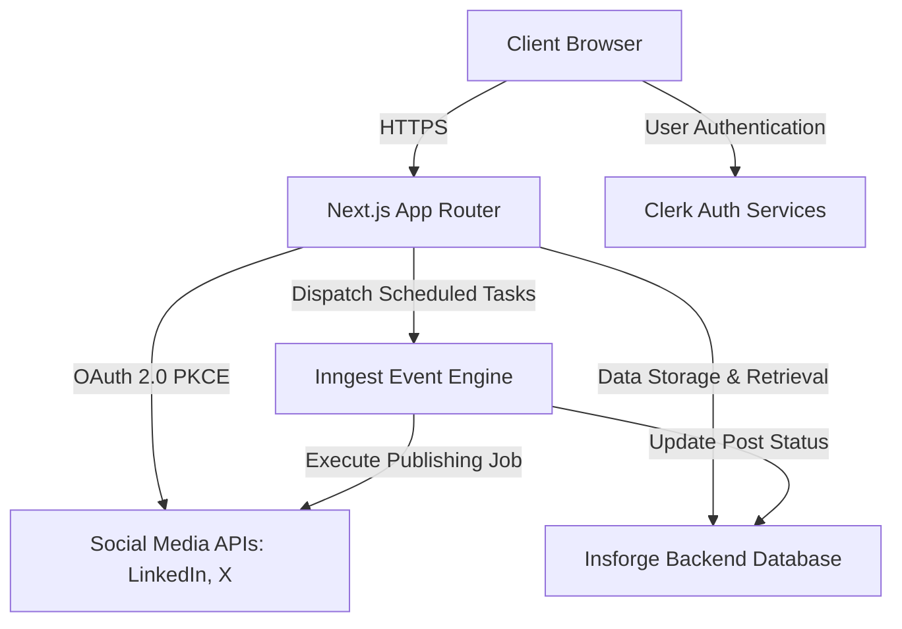

# OnionAI

**Enterprise-Grade AI-Powered Social Media Management Platform**

OnionAI is a production-ready, full-stack software-as-a-service (SaaS) application engineered to streamline social media content creation, management, and automated publishing. By integrating advanced artificial intelligence capabilities with robust background job processing, the platform serves as an automated, highly reliable social media command center.

Designed for scalability, the application features an intuitive Kanban board for content ideation, comprehensive calendar views for schedule management, and seamless OAuth 2.0 integrations with major networks such as LinkedIn and X (formerly Twitter).

---

## System Architecture

The following diagram illustrates the high-level system architecture, demonstrating how the core components interact to provide a secure and scalable scheduling experience.



### Core Components

- **Client Layer:** A highly responsive frontend utilizing Next.js Server Components, Tailwind CSS, and Shadcn UI.
- **Authentication (Clerk):** Manages user sessions, secure sign-ups, and sign-ins.
- **Application Server (Next.js):** Handles API routes, server-side rendering, and orchestrates requests between services.
- **Background Processing (Inngest):** A robust event-driven engine responsible for executing cron jobs and asynchronously publishing scheduled social media posts without blocking the main application thread.
- **Database (Insforge):** Serves as the primary data store for user profiles, OAuth tokens, content ideas, and scheduled post metadata.
- **External Integrations:** Direct integration with the LinkedIn API v2 and Twitter API v2 for native content publishing.

---

## Technical Specifications

The project leverages industry-standard technologies to ensure maintainability, performance, and security.

- **Framework:** Next.js (App Router)
- **Language:** TypeScript
- **Styling:** Tailwind CSS, Shadcn UI
- **Authentication:** Clerk
- **Event Engine & Cron:** Inngest
- **Database:** Insforge
- **Integrations:** Twitter API v2, LinkedIn API v2

---

## Core Features

- **Secure Authentication:** Enterprise-grade user identity management powered by Clerk.
- **Multi-Channel Social OAuth:** Secure connection to multiple social media platforms utilizing OAuth 2.0 with PKCE for enhanced security.
- **AI Content Generation:** Integrated artificial intelligence to draft, rephrase, expand, or condense posts dynamically.
- **Visual Schedule Management:** Comprehensive planning interfaces featuring interactive Calendar and List views.
- **Kanban Ideation Pipeline:** A structured visual workflow to progress content from initial concept to published status.
- **Automated Publishing:** Reliable, background execution of scheduled posts managed via Inngest cron jobs.
- **Platform-Specific Previews:** High-fidelity, pixel-perfect preview components tailored to replicate the native feed environments of each social channel.

---

## Installation and Setup

Follow these instructions to establish a local development environment.

### 1. Repository Setup

Clone the repository and install the necessary dependencies:

```bash
git clone https://github.com/your-username/onionai.git
cd onionai

# Install dependencies using npm, yarn, pnpm, or bun
npm install
```

### 2. Environment Configuration

Create a `.env` file in the project root by copying the provided `.env.example`. You must obtain API credentials from your respective service providers.

#### Authentication (Clerk)
- `NEXT_PUBLIC_CLERK_PUBLISHABLE_KEY`: Your Clerk publishable key.
- `CLERK_SECRET_KEY`: Your Clerk secret key.
- `NEXT_PUBLIC_CLERK_SIGN_IN_URL=/sign-in`
- `NEXT_PUBLIC_CLERK_SIGN_UP_URL=/sign-up`

#### Application Settings
- `NEXT_PUBLIC_APP_URL`: The fully qualified domain name of your application (e.g., `http://localhost:3000` or a development tunnel URL).

#### Security & Encryption
Generate two secure 32-byte base64 strings (e.g., using `openssl rand -base64 32`).
- `CHANNEL_OAUTH_STATE_SECRET`: Secures OAuth flows against CSRF attacks.
- `CHANNEL_TOKEN_ENCRYPTION_KEY`: Secures stored OAuth access and refresh tokens at rest.

#### Social Platform Credentials
**LinkedIn:**
- `LINKEDIN_CLIENT_ID`: OAuth 2.0 Client ID from the LinkedIn Developer Portal.
- `LINKEDIN_CLIENT_SECRET`: OAuth 2.0 Client Secret from the LinkedIn Developer Portal.

**X (Twitter):**
- `TWITTER_CLIENT_ID`: OAuth 2.0 Client ID from the Twitter Developer Portal.

### 3. Application Execution

Start the Next.js development server:

```bash
npm run dev
```

The application will be accessible at [http://localhost:3000](http://localhost:3000).

### 4. Background Services Execution

To process background jobs and test scheduled publishing locally, launch the Inngest development server in a separate terminal session:

```bash
npx inngest-cli@latest dev
```

---

## Development Guidelines

When contributing to this repository, please adhere to the following guidelines:

1. Create feature branches from the `main` branch.
2. Ensure all TypeScript strict mode checks pass before committing.
3. Write clear, descriptive commit messages.
4. Open a Pull Request detailing the scope of your changes and any related issue tracking numbers.

---
